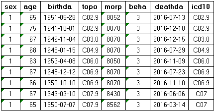

## CANREG tools - Cancer registration

This CANREG tool was developed by [Cancer Epidemiology Department at Henan Cancer Hospital](http://anti-cancer.com.cn/) in China.

The CANREG tools aims to perform the functions as follows:

- Calculate Cancer incidence and mortality and corresponding quality control indicators

- Visualization of Cancer incidence and mortality.

- Mapping of Cancer Registration.

## Input data format

This tools require the input data stored in Excel sheets named as FB,SW, and POP.

- FB

- SW

- POP

## Updates

## Author
Dr Qiong Chen, Cancer Epidemiology, Henan Cancer Center / Henan Cancer Hospital, Zhengzhou, 450008, China.

## Find me here
Chenq08@126.com

[Personal web page](http://www.chenq.site)

***
---